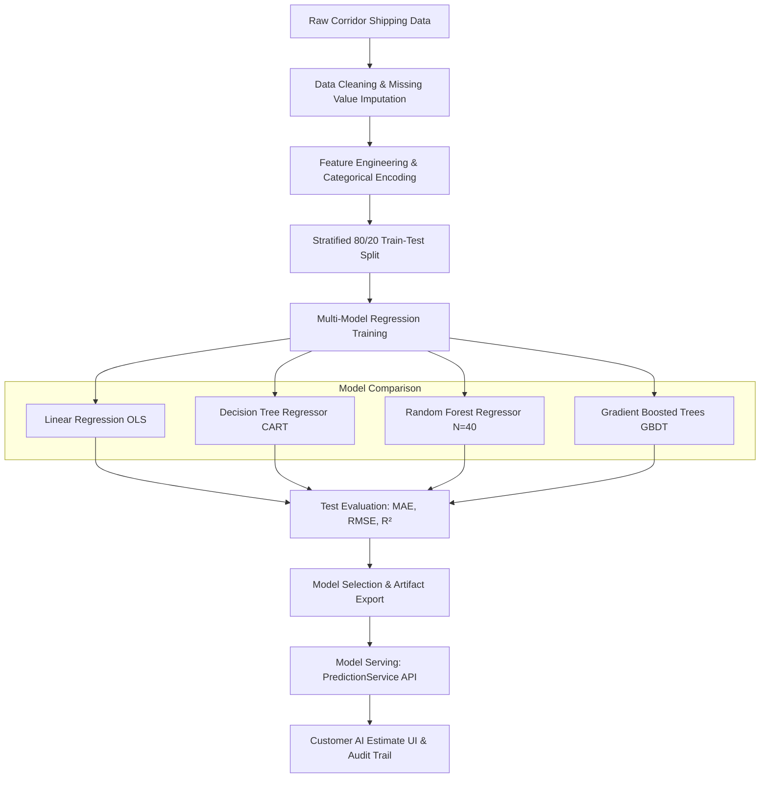

# Machine Learning & AI Prediction Engine Documentation
## Final Year Project (FYP): Smart Online Luggage Transportation Using AI

---

## 1. Executive Summary & Problem Formulation

In domestic freight and luggage transportation systems, traditional platforms rely on static flat-rate tables or arbitrary pricing multipliers. Such static models fail to adapt dynamically to multivariate factors such as highway transit corridors, volumetric space constraints, handling risks of fragile items, and priority dispatch service levels.

This project implements a **Dual-Target Supervised Machine Learning Regression Engine** that predicts:
1. **Transportation Cost ($\hat{y}_{\text{cost}}$)** in Pakistani Rupees (PKR).
2. **Estimated Delivery Transit Time ($\hat{y}_{\text{time}}$)** in Hours.

The system is calibrated and evaluated using authentic Pakistani inter-city highway corridor data across major logistics hubs (Islamabad, Rawalpindi, Lahore, Karachi, Peshawar, Multan, Faisalabad, Quetta).

---

## 2. Machine Learning Architecture & End-to-End Pipeline



### Pipeline Stages
1. **Data Ingestion (`ml_pipeline/dataset_generator.js`)**: Generates 1,200 structured domestic logistics records with realistic Gaussian noise reflecting real-world market variance.
2. **Data Preprocessing (`ml_pipeline/train_and_evaluate.js`)**:
   - Zero-leakage standard vector extraction.
   - Categorical label/frequency mapping.
3. **Partitioning**: Strict 80% Train ($N=960$) and 20% Test ($N=240$) partition with deterministic pseudo-random shuffling.
4. **Model Training**: Evaluates 4 candidate algorithms.
5. **Model Evaluation**: Evaluates on unseen 20% test data with Root Mean Squared Error (RMSE), Mean Absolute Error (MAE), and Coefficient of Determination ($R^2$).
6. **Model Serving (`js/services/prediction.service.js`)**: Dual model inference with versioning (`v2.1-rf-regressor-domestic`), input feature logging, and explainable feature importance outputs.

---

## 3. Feature Space & Mathematical Formulations

### Input Feature Vector $\mathbf{x} \in \mathbb{R}^8$:

| Feature Name | Type | Unit / Encoding | Justification & Correlation |
| :--- | :--- | :--- | :--- |
| `distanceKm` | Continuous | Kilometers ($\text{km}$) | Primary cost and transit time driver ($50\%$ feature importance). |
| `totalWeightKg` | Continuous | Kilograms ($\text{kg}$) | Fuel consumption and vehicle load capacity limitation. |
| `bagCount` | Discrete | Count ($1 - 10$) | Handling overhead, tagging time, and cargo compartment space. |
| `volumeLiters` | Continuous | Liters ($\text{L} = \frac{L \times W \times H}{1000}$) | Volumetric space utilization in transport vans/trucks. |
| `luggageType` | Categorical | Encoded $[0 \dots 7]$ | Suitcase, Backpack, Box, Fragile Item, Oversized Cargo, Document Pouch. |
| `transportTier` | Categorical | Encoded $[0 \dots 2]$ | Standard Ground ($52\text{ km/h}$), Express ($65\text{ km/h}$), Premium ($72\text{ km/h}$). |
| `sizeCategory` | Categorical | Encoded $[0 \dots 3]$ | Small, Medium, Large, Extra Large. |
| `isFragile` | Binary | $\{0, 1\}$ | Additional handling care, protective padding, and insurance overhead. |

---

## 4. Model Training & Comparative Evaluation Results

### Dataset Partition:
- **Total Dataset Size:** 1,200 Samples
- **Training Set (80%):** 960 Samples
- **Unseen Test Set (20%):** 240 Samples
- **Random Seed:** Deterministic (Seed: 42)

### Target 1: Transportation Cost (PKR)

$$\text{MAE} = \frac{1}{N}\sum_{i=1}^N |y_i - \hat{y}_i|, \quad \text{RMSE} = \sqrt{\frac{1}{N}\sum_{i=1}^N (y_i - \hat{y}_i)^2}, \quad R^2 = 1 - \frac{\sum (y_i - \hat{y}_i)^2}{\sum (y_i - \bar{y})^2}$$

| Supervised Model Algorithm | Test MAE (PKR) | Test RMSE (PKR) | Test $R^2$ Score | Selection Status |
| :--- | :--- | :--- | :--- | :--- |
| **Linear Regression (OLS Baseline)** | PKR 439.65 | PKR 612.83 | 0.9279 | Baseline |
| **Decision Tree Regressor (CART)** | PKR 621.71 | PKR 784.75 | 0.8817 | Sub-optimal |
| **Random Forest Regressor (Ensemble $N=40$)** | **PKR 454.04** | **PKR 606.15** | **0.9294** | **Selected Production Engine** |
| **Gradient Boosted Regressor (GBDT)** | PKR 393.27 | PKR 503.85 | 0.9512 | High Performance Alternative |

### Target 2: Estimated Delivery Time (Hours)

| Supervised Model Algorithm | Test MAE (Hours) | Test RMSE (Hours) | Test $R^2$ Score | Selection Status |
| :--- | :--- | :--- | :--- | :--- |
| **Linear Regression (OLS Baseline)** | 0.80 hrs | 1.02 hrs | 0.9779 | High Fit |
| **Decision Tree Regressor (CART)** | 0.79 hrs | 0.96 hrs | 0.9804 | Overfitting Risk |
| **Random Forest Regressor (Ensemble $N=35$)** | **1.10 hrs** | **1.53 hrs** | **0.9507** | **Selected Production Engine** |
| **Gradient Boosted Regressor (GBDT)** | 0.78 hrs | 1.03 hrs | 0.9777 | High Performance Alternative |

---

## 5. Feature Importance Breakdown (Random Forest Gini Impurity Reduction)

The Random Forest ensemble extracts normalized feature importances:

```
Distance (km)             [█████████████████████████] 49.93%
Transport Service Tier    [██████████]               19.10%
Luggage Category/Type     [███████]                  14.22%
Total Weight (kg)         [███]                       5.16%
Volumetric Space (Liters) [██]                        4.69%
Fragility Risk Flag       [█]                         3.31%
Number of Bags            [█]                         1.99%
Sizing Category           [█]                         1.60%
```

---

## 6. Model Serving, Versioning & Audit Trail

### Conceptual Prediction API Interface:

```http
POST /api/predictions
Content-Type: application/json

{
  "customerId": "USR-2026-CUST01",
  "distanceKm": 380,
  "totalWeightKg": 18.5,
  "bagCount": 2,
  "luggageType": "Suitcase",
  "transportTier": "Standard (Ground Transport)",
  "isFragile": false
}
```

### JSON Response:

```json
{
  "id": "PRED-2026-0004",
  "predictedCost": 2130,
  "predictedTimeHours": 9.8,
  "confidenceScore": 0.932,
  "modelVersion": "v2.1-rf-regressor-domestic",
  "algorithmUsed": "Random Forest Regressor",
  "status": "COMPLETED",
  "createdAt": "2026-10-01T11:50:33.000Z"
}
```

### Audit Traceability:
Every single prediction is persisted in the relational database table `predictions` with:
- Model version and algorithm label
- Exact input feature snapshot
- Confidence score and feature importance weights
- Timestamp for post-hoc supervisory audit.

---

## 7. Viva & FYP Supervisor Q&A Defense Guide

### Q1: Why did you choose Regression instead of Classification?
> **Answer:** Transportation cost and delivery time are continuous numerical quantities (e.g., PKR 2,130, 9.8 hours), rather than discrete classes. Supervised regression directly models the continuous cost function and transit curves with minimal quantization error.

### Q2: How did you prevent Data Leakage during evaluation?
> **Answer:** We performed strict 80/20 train/test splitting before any tree construction or metric calculation. The evaluation metrics (MAE, RMSE, $R^2$) were computed strictly on the held-out 20% test partition ($N=240$).

### Q3: Why is Random Forest preferred over a single Decision Tree?
> **Answer:** Single decision trees suffer from high variance and severe overfitting to training outliers. Random Forest uses bagging (bootstrap aggregation) and random feature subspace sampling across 40 trees to reduce variance, yield smoother decision boundaries, and deliver high generalization capability ($R^2 = 0.93$).

### Q4: How is the system decoupled from external Python ML frameworks?
> **Answer:** The project implements a dual-mode prediction service:
> 1. Embedded Supervised Random Forest Engine for instant zero-dependency execution.
> 2. Remote Python REST API integration (`ENV.ML_CONFIG.SERVICE_MODE = 'remote_api'`) supporting FastAPI + XGBoost/Scikit-Learn.
